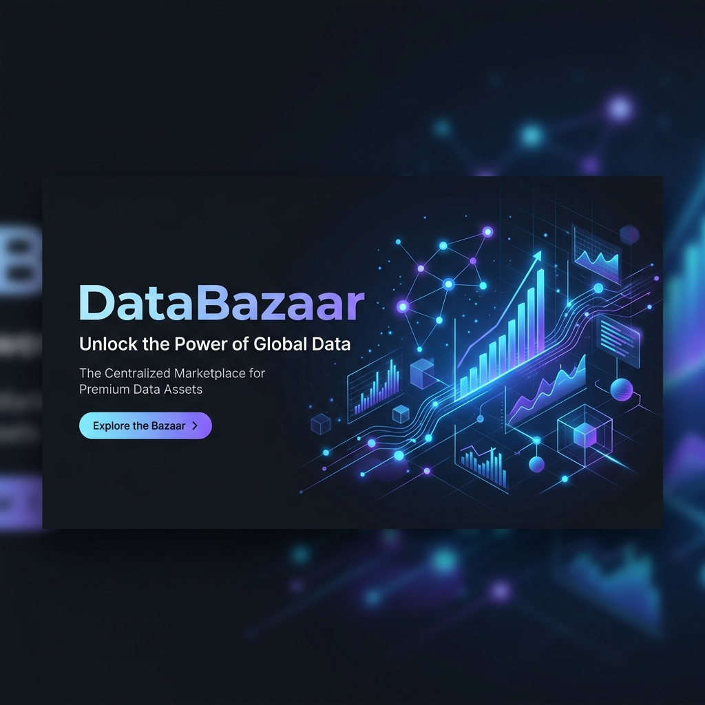

# DataBazaar — Market Intelligence & Databank Platform



## 🌐 Overview
**DataBazaar** is a premium, production-ready SaaS platform designed for the systematic collection, analysis, and sharing of market data. Built with a focus on high performance and minimalist aesthetics, it enables organizations and individual contributors to build comprehensive databanks of commodity prices, market trends, and regional insights across India.

The platform transforms raw price observations into actionable intelligence through interactive visualizations and a robust moderation workflow.

---

## 👥 Roles & Permissions

DataBazaar features a dual-role architecture designed for both collaborative data entry and strict administrative oversight.

### 🛡️ Administrator (Admin)
The "Super-user" of the platform with full visibility and control.
- **Data Moderation**: Review all incoming user submissions. Approve entries to make them public or reject them with feedback.
- **User Management**: Monitor the community, block/unblock users, and manage account statuses.
- **Global Analytics**: Access high-level trends across all categories and locations.
- **System Hardening**: Oversight of all platform data and structural integrity.

### ✍️ Contributor (Registered User)
The primary data generator of the platform.
- **Personal Dashboard**: View personal submission statistics and price trend charts.
- **Data Submission**: Submit single price observations or perform **Bulk CSV Imports**.
- **Management**: Edit or delete their own pending submissions.
- **Bookmarks**: Save critical market data entries for quick reference.
- **Public Sharing**: Generate secure, tokenized links to share specific data insights with external stakeholders without requiring them to log in.

---

## ✨ Key Features

### 📊 Advanced Data Visualization
- **Trend Charts**: Dynamic line charts showing price fluctuations over a 30-day period.
- **Category Breakdown**: Interactive doughnut charts illustrating data distribution across various market segments.
- **Empty States**: Professional illustrations and placeholders for empty dashboards to maintain UI polish.

### 🔍 Market Explorer
- **Precision Filtering**: Search through thousands of records by Category, Location, or Status (Approved/Pending).
- **Responsive Tables**: Clean, minimalist data tables optimized for both desktop and mobile viewing.
- **Real-time Search**: Instant keyword filtering across product names and locations.

### 📂 Submission & Import Engine
- **Single Entry**: A streamlined form with real-time validation and loading states.
- **Bulk Import**: A robust CSV parsing engine that allows users to upload hundreds of records at once.
- **Moderation Workflow**: Every submission undergoes an "Admin Review" phase to ensure data quality before appearing in the public Explorer.

### 🔒 Security & Performance
- **N+1 Optimized**: Heavily optimized database queries to ensure fast page loads even with large datasets.
- **Blocked User Middleware**: Integrated security that instantly revokes access for blocked accounts.
- **Tokenized Sharing**: Secure, non-sequential tokens for public data sharing.
- **CSRF Protection**: Standard security protocols across all forms and API endpoints.

### 🌗 Premium UI/UX
- **Glassmorphism Design**: Modern, translucent interface elements with smooth transitions.
- **Global Dark Mode**: A unified theme store that syncs preferences across the entire application (including mobile).
- **Responsive Layout**: A mobile-first design approach ensuring full functionality on all devices.
- **Inter Typography**: Uses the professional Inter typeface for maximum readability.

---

## 🛠️ Tech Stack
- **Backend**: Laravel 12 (PHP 8.2+)
- **Frontend**: Tailwind CSS 4.0, Alpine.js 3.x
- **Database**: SQLite (Dev) / MySQL or PostgreSQL (Prod)
- **Charts**: Chart.js 4.x
- **Icons**: Heroicons
- **Asset Bundling**: Vite 7.x

---

## 🚀 Installation & Setup

### Prerequisites
- PHP 8.2 or higher
- Composer
- Node.js & NPM

### Setup Steps
1. **Clone the Repository**
   ```bash
   git clone https://github.com/yourusername/databazaar.git
   cd databazaar
   ```

2. **Install Dependencies**
   ```bash
   composer install
   npm install
   ```

3. **Environment Configuration**
   ```bash
   cp .env.example .env
   php artisan key:generate
   ```

4. **Database Setup**
   ```bash
   touch database/database.sqlite
   php artisan migrate --seed
   ```

5. **Build Assets**
   ```bash
   npm run build
   ```

6. **Start the Application**
   ```bash
   php artisan serve
   ```

---

## 📖 Usage Guide

### 1. Contributing Data
Navigate to the **Submit** tab. You can either fill out the individual form for a single observation or use the **Upload CSV** feature for bulk data. All data submitted will appear as "Pending" until an administrator approves it.

### 2. Exploring Market Insights
Use the **Explore** tab to browse approved market data. Use the filters in the header to narrow down by category (e.g., Grains, Vegetables) or specific cities (e.g., Delhi, Mumbai).

### 3. Bookmarking & Sharing
If you find a valuable data point, click the **Bookmark** icon. You can view all saved items in your Bookmarks tab. To share data, click the **Share** icon to generate a unique public link.

### 4. Admin Moderation
Admins can access the **Admin Panel** via the navigation bar. From there, go to **Data Moderation** to review submissions. Click **Approve** to publish them to the platform.

---

## 📜 License
This project is licensed under the MIT License - see the [LICENSE](LICENSE) file for details.

---

Built with ❤️ by the DataBazaar Team.
