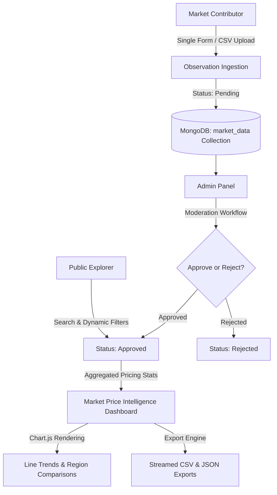

# 📊 DataBazaar: Premium Market Databank & Price Intelligence Platform

DataBazaar is a state-of-the-art, premium Market Databank Generation and Price Intelligence Sharing Platform. Designed with a gorgeous, high-contrast glassmorphic SaaS interface and powered by a highly optimized Laravel 12 + MongoDB NoSQL database engine, DataBazaar enables real-time price tracking, regional volatility analysis, interactive Chart.js visualizations, bulk CSV processing, and professional multi-role administrative workflows.

---

## ⚡ Core Pillars of DataBazaar

*   **⚡ Premium Glassmorphic Design System**: Engineered with Tailwind CSS, custom HSL color palettes, high-contrast capsule badges, and seamless micro-animations, standardizing typography under the premium *Inter* typeface.
*   **🛢️ Robust NoSQL Architecture**: Powered by MongoDB (`mongodb/laravel-mongodb`), utilizing raw regex queries, Eloquent-compatible casting, and high-performance collection-based grouping to process massive volumes of market observations.
*   **📊 Market Price Intelligence**: Interactive Chart.js visualizations tracking Line Trends, Region-to-Region price comparison charts with dynamic checkbox plotting, volatility standard-deviation rating, and Single-Point fallbacks.
*   **🔒 Multi-Role Access & Moderation**: Built with Laravel Breeze authentication, dynamic user role auditing, secure observation moderation, user blocking middleware, and automated transaction logging.

---

## 🏗️ System Architecture

The following Mermaid diagram visualizes the flow of market observations from contribution to dynamic public analytics:



---

## 🛠️ Technology Stack & Requirements

### Core Architecture
*   **Backend Framework**: Laravel 12.x (PHP 8.2+)
*   **Database Engine**: MongoDB (configured via `mongodb/laravel-mongodb` v5.7)
*   **Frontend Engine**: Tailwind CSS, Alpine.js 3.x
*   **Interactive Visualizations**: Chart.js 4.x
*   **Asset Bundler**: Vite 7.x
*   **Template Engine**: Blade HTML5 Layouts

### Server Dependencies
*   PHP MongoDB Extension (`php_mongodb.dll` or `php_mongodb.so`)
*   Local or Atlas MongoDB instance running on `mongodb://127.0.0.1:27017`

---

## 🚀 Professional Installation & Setup

Follow these streamlined instructions to deploy DataBazaar in your local environment.

### Prerequisites

Verify that the PHP MongoDB driver is active on your local machine:
```bash
php -m | grep mongodb
```

### Installation Steps

1.  **Clone & Enter the Repository**
    ```bash
    git clone https://github.com/yourusername/databazaar.git
    cd databazaar
    ```

2.  **Install PHP & Frontend Dependencies**
    ```bash
    composer install
    npm install
    ```

3.  **Environment Setup**
    Copy the environment variables and generate a secure application key:
    ```bash
    cp .env.example .env
    php artisan key:generate
    ```

4.  **Database Connection Configuration**
    Open `.env` and verify your MongoDB parameters:
    ```env
    DB_CONNECTION=mongodb
    DB_HOST=127.0.0.1
    DB_PORT=27017
    DB_DATABASE=databazaar
    DB_USERNAME=
    DB_PASSWORD=
    ```

5.  **Initialize Database & Mock Data**
    Run the Laravel migrations and database seeders to populate the MongoDB database with 100+ approved observations and initial administrative accounts:
    ```bash
    php artisan migrate --seed
    ```

6.  **Compile Production Assets**
    ```bash
    npm run build
    ```

7.  **Launch the Application**
    Start the local development server:
    ```bash
    php artisan serve
    ```
    Access the application immediately at `http://localhost:8000`.

---

## 📂 Project Directory Structure

```text
├── app/
│   ├── Http/
│   │   ├── Controllers/       # Handles API Suggestions, Analytics, Exports & Admin Actions
│   │   └── Middleware/        # BlockedUser handling for immediate administrative kick-outs
│   └── Models/                # MongoDB Eloquent Models (User, MarketData, AuditLog)
├── config/
│   └── database.php           # Configured MongoDB Connection drivers
├── database/
│   ├── migrations/            # NoSQL-compatible schema migrations
│   └── seeders/               # MarketDataSeeder generating high-fidelity price datasets
├── resources/
│   ├── css/
│   │   └── app.css            # Custom CSS definitions (Glassmorphism & Stats cards)
│   └── views/
│       ├── layouts/           # Unified Breeze navigation & dark-mode layouts
│       ├── public/            # Public-facing Explorer and spacious Intelligence Analytics
│       └── admin/             # Table-responsive Moderation & Audit panels
├── routes/
│   └── web.php                # Group routes, role auth protection, and stream downloads
└── composer.json              # Configured shortcuts and dependencies
```

---

## 📖 Feature Walkthrough & Usage

### 📊 1. Market Price Intelligence Dashboard (`/intelligence`)
*   **Double-Row Typography**: High-contrast header with full breathing space and an outline "Back to Catalog" button.
*   **Dedicated Control Toolbar**: Premium capsule date pickers (`From` & `To`) locked to comfortable fixed widths, eliminating native-browser picker overlapping.
*   **Fast Product Switcher**: Dynamic Alpine.js search autocomplete matching commodity listings in the database via regex queries.
*   **Taller Charts View**: Custom responsive container (`h-[380px] sm:h-[420px]`) allowing dynamic Line, Bar, and Volatility trends to render beautifully without text squishing.

### 🔍 2. Market Explorer (`/explore`)
*   **Advanced Live Filter Grid**: Filter the database catalog by distinct Categories, Locations, or search queries.
*   **Quick Bookmarking**: Click the Favorite star button to bookmark any approved observation; bookmarked insights sync in real-time under the `/bookmarks` path.
*   **Data Export Engine**: Instantly stream database records using secure memory streams to structured **CSV** and **JSON** files without request lag.

### 📥 3. Collaborative Data Contribution (`/submit`)
*   **Transactional Forms**: Easy-to-use form with real-time numeric validation for commodity names, locations, and prices.
*   **CSV Bulk Importer**: Support for high-volume data importing. Uploaded CSVs are parsed, formatted, and validated automatically.

### 🛡️ 4. Administrative Moderation & Audits (`/admin`)
*   **Data Approvals (`/admin/data`)**: A table-responsive dashboard showing pending submissions. Admins can approve or reject observations with a single click, triggering real-time database updates and dispatching verification mailers.
*   **User Registry Audits (`/admin/users`)**: Audit all registered contributors. Block or unblock users instantly. The dynamic `BlockedUser` middleware intercepts requests and forces automated sessions logs out for blocked user accounts.

---

## 📜 Development Scripts (`composer.json`)

DataBazaar provides native Composer scripts to speed up development tasks:

*   **One-Step Setup**: Runs composer install, copies config, generates keys, runs migrations, installs npm, and builds compiled files:
    ```bash
    composer run setup
    ```
*   **Concurrently Run Servers**: Launches the development server, queue workers, log stream, and Vite asset compiler concurrently:
    ```bash
    composer run dev
    ```
*   **Run Automated Tests**: Clears config cache and initiates local PHPUnit assertions:
    ```bash
    composer run test
    ```

---

## 📜 License
This project is licensed under the MIT License - see the [LICENSE](LICENSE) file for details.

---

*Designed and engineered with ❤️ to provide unparalleled market price intelligence.*
